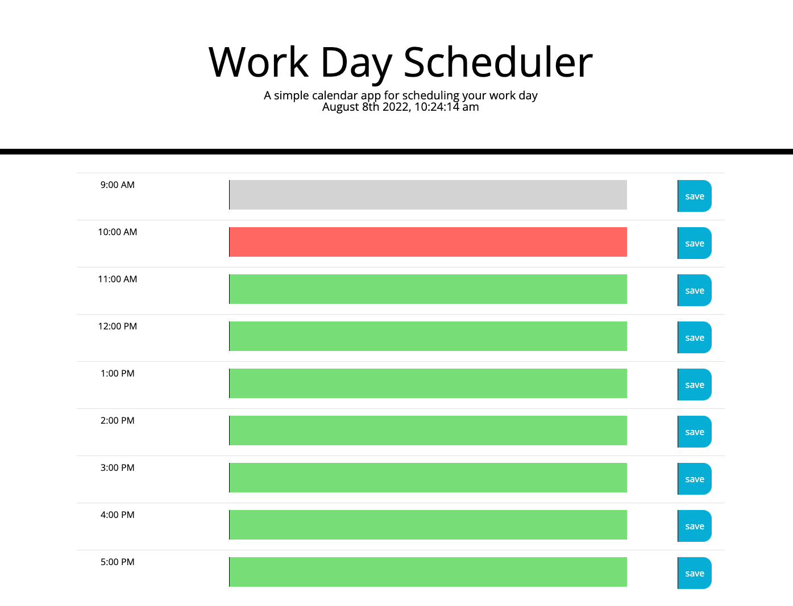

# work-day-scheduler
## Work Day Scheduler

Deployed Link:
[https://sprantis.github.io/work-day-scheduler/]

Description:
I have refactored a daily planner application to be efficient and productive.The planner asks for user’s input for event fields and has the ability to be saved for the current day. Once a time period has expired the color of the field will change to gray. Future events and time periods remain green. Present events and time periods are red. 

Screenshot:

Repo Link:
[https://github.com/sprantis/work-day-scheduler]