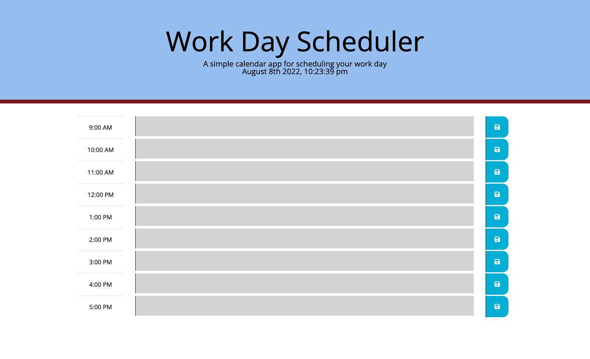

# work-day-scheduler
## Work Day Scheduler

Deployed Link:
[https://sprantis.github.io/work-day-scheduler/]

Description:
I have refactored a work day scheduler application to allow users to write and save notes via local storage. The planner also keeps track of the current date and time. Time blocks are color-coded for past, present, and future work hours relative to the current time.

Screenshot:

Repo Link:
[https://github.com/sprantis/work-day-scheduler]